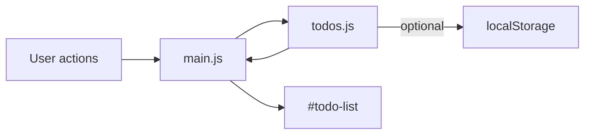

# Initial Todo App (Vite + Vanilla JS)

## Current state

The repo is a standard Vite 8 vanilla JS scaffold ([`package.json`](package.json), [`index.html`](index.html), [`src/main.js`](src/main.js)) with a counter demo ([`src/counter.js`](src/counter.js)) and starter CSS ([`src/style.css`](src/style.css)). Dependencies are already installed (`pnpm dev` works).

## Target features (from [`notes.md`](notes.md))

- Add new todos
- Mark complete / mark incomplete (toggle)
- Delete a todo
- No backend

## Architecture

Keep it simple: a small state module plus a UI module that re-renders on every change.



**Todo shape:** `{ id: string, text: string, completed: boolean }`

**State API** in new [`src/todos.js`](src/todos.js):

- `getTodos()` — return current list
- `addTodo(text)` — trim text, ignore empty; generate id with `crypto.randomUUID()`
- `toggleTodo(id)` — flip `completed`
- `deleteTodo(id)` — remove by id
- `loadTodos()` / `saveTodos()` — read/write JSON to `localStorage` key `todolist-app-todos` on init and after each mutation (no backend; survives refresh)

**UI** in [`src/main.js`](src/main.js):

- Replace starter HTML with a focused todo layout
- `render()` — clear and rebuild `#todo-list` from state (simple and fine for a prototype)
- Form submit on `#todo-form` → `addTodo`, clear input, re-render
- Checkbox change → `toggleTodo`
- Delete button click → `deleteTodo`
- Empty state message when list is empty

**HTML shell** in [`index.html`](index.html):

- Update `<title>` to "Todo List"
- Static structure inside `#app`: heading, form (`input` + Add button), empty `<ul id="todo-list">`

**Styles** in [`src/style.css`](src/style.css):

- Replace Vite boilerplate with a clean, centered card layout
- Reuse existing CSS variables where possible (light/dark via `prefers-color-scheme`)
- Style: strikethrough/muted text for completed items, visible focus states, mobile-friendly input

## Files to change

| Action | File |
|--------|------|
| Edit | [`index.html`](index.html) — todo shell + title |
| Replace | [`src/main.js`](src/main.js) — UI + event wiring |
| New | [`src/todos.js`](src/todos.js) — state + localStorage |
| Replace | [`src/style.css`](src/style.css) — todo-specific styles |
| Delete | [`src/counter.js`](src/counter.js) — no longer needed |

No changes to [`package.json`](package.json) or Vite config required.

## UI sketch

```
┌─────────────────────────────┐
│  To Do List                 │
│  [ What needs to be done? ] Add │
│                             │
│  ☐ Buy groceries      Delete │
│  ☑ Walk the dog       Delete │
└─────────────────────────────┘
```

## Verification

1. `pnpm dev` — app loads without console errors
2. Add a todo via form and Enter key
3. Checkbox toggles complete ↔ incomplete (visual + state)
4. Delete removes item
5. Refresh page — todos still present (localStorage)
6. `pnpm build` — production build succeeds
